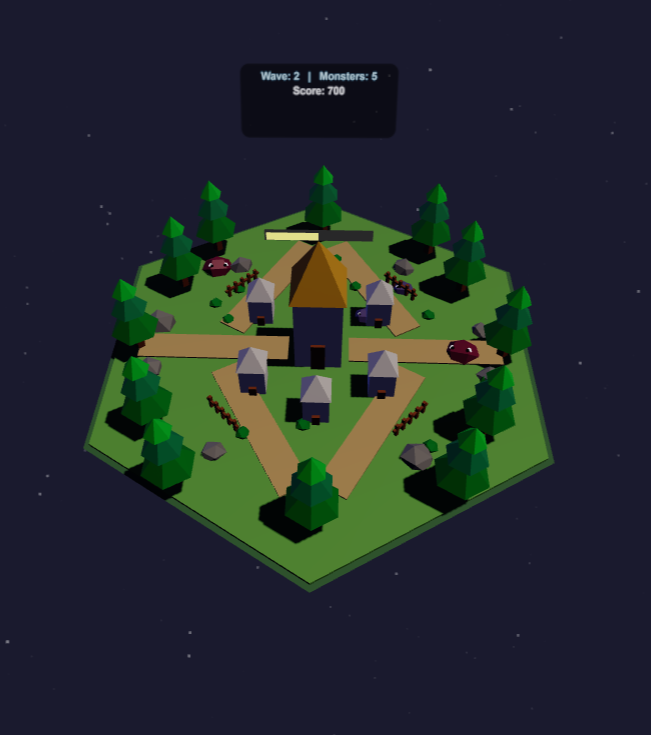

# Tiny Realm

Ein VR-Spiel für Meta Quest und Browser, in dem man eine kleine Insel aus der Gott-Perspektive gegen angreifende Slimes verteidigt. Entwickelt im Rahmen des Kurses Mensch-Computer-Interaktion 2 an der Hochschule Esslingen.

## Screenshots

  

## Technologien

- Three.js
- WebXR
- JavaScript

---

## Installation & Start

Da WebXR (VR im Browser) einen lokalen Server benötigt, ist die einfachste Methode die Nutzung von Visual Studio Code und der "Live Server" Extension.

### Voraussetzungen

1.  **Visual Studio Code** (Code Editor)
2.  **Live Server Extension** (in VS Code installieren)
3.  **Meta Quest** (1, 2, 3 oder Pro)
4.  **Meta Quest Link App** (für PC-Verbindung via Kabel oder Air Link)

### Schritt-für-Schritt Anleitung

1.  **Projekt öffnen:**
    Öffne den Projektordner in Visual Studio Code.

2.  **Server starten:**
    Rechtsklick auf die `index.html` Datei und wähle **"Open with Live Server"**.
    - Es öffnet sich automatisch ein Browserfenster (meistens unter `http://127.0.0.1:5500`).

3.  **VR-Headset verbinden:**
    - Verbinde deine Meta Quest via USB-Kabel (Link) oder WLAN (Air Link) mit dem PC.
    - Starte "Quest Link" im Headset, sodass du deinen PC-Desktop siehst.

4.  **Spiel starten:**
    - Öffne auf deinem PC (während du in Link bist) einen WebXR-fähigen Browser (Chrome, Edge).
    - Navigiere zur URL des Live Servers.
    - Klicke unten auf den Button **"ENTER VR"**.

---

## Steuerung

### VR-Modus (Meta Quest Controller)

| Aktion           | Taste / Geste                       | Beschreibung                                                                                             |
| :--------------- | :---------------------------------- | :------------------------------------------------------------------------------------------------------- |
| **Greifen**      | **Trigger** (Zeigefinger)           | Zielen & Drücken, um Objekte (Bäume, Steine, Monster) hochzuheben.                                       |
| **Werfen**       | **Armbewegung + Trigger loslassen** | Schleudere Objekte auf Gegner.                                                                           |
| **Insel drehen** | **Grip** (Mittelfinger)             | Drücke **beide** Grip-Tasten gleichzeitig und bewege die Hände, um die Insel wie einen Teller zu drehen. |
| **Zielen**       | **Laser**                           | Ein blauer Laser zeigt an, welches Objekt du greifen kannst.                                             |

### Desktop-Modus (Debug / Testen ohne Brille)

| Aktion         | Taste / Maus                   | Beschreibung                                        |
| :------------- | :----------------------------- | :-------------------------------------------------- |
| **Mauszeiger** | Bewegen                        | Bewegt die "virtuelle Hand".                        |
| **Greifen**    | **Taste 'B'** (halten/drücken) | Simuliert das Drücken des Triggers.                 |
| **Werfen**     | **'B' loslassen**              | Wirft das Objekt in Blickrichtung der Mausbewegung. |

---

## Spielmechanik

### Das Ziel

Verteidige das Dorf in der Mitte der Insel. Wenn zu viele Monster das Dorf erreichen, verlierst du (bzw. das Dorf nimmt Schaden).

### Physik & Interaktion

- **Alles ist eine Waffe:** Du kannst fast alles auf der Insel greifen – Bäume, Felsen und sogar die Gegner selbst.
- **Schaden:** Wirf Steine auf Monster, um ihnen Schaden zuzufügen.
- **Instant Kill:** Wirf Monster von der Insel in den Abgrund ("Void"), um sie sofort zu besiegen.
- **Magie-Effekt:** Wenn du Objekte hältst, rotieren sie leicht in deiner Hand (Telekinese-Effekt).
- **Trails:** Geworfene Objekte ziehen einen Partikel-Schweif hinter sich her (Rot für Monster, Orange für Gegenstände).

### Umgebung

Die Insel schwebt in einem "Ständer" vor dir (God-View). Durch die Rotation (beide Grips) hast du immer den perfekten Überblick über das Schlachtfeld.
